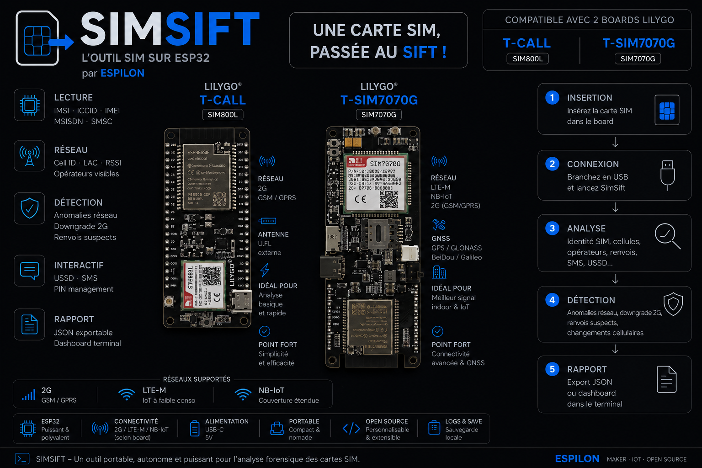
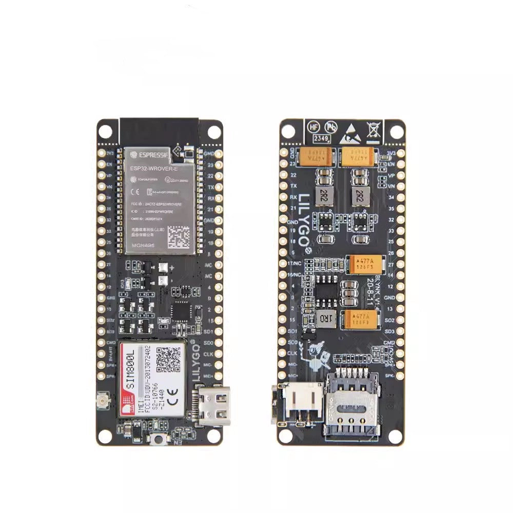
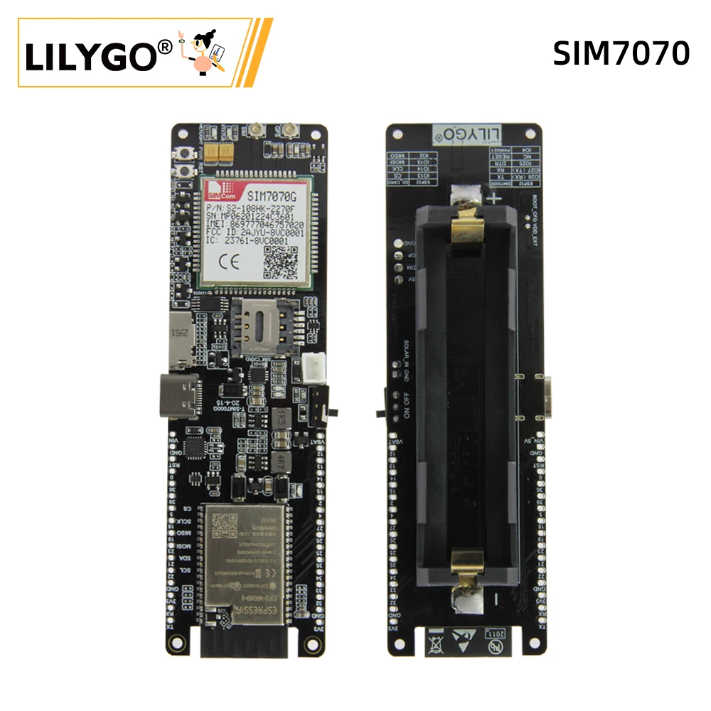
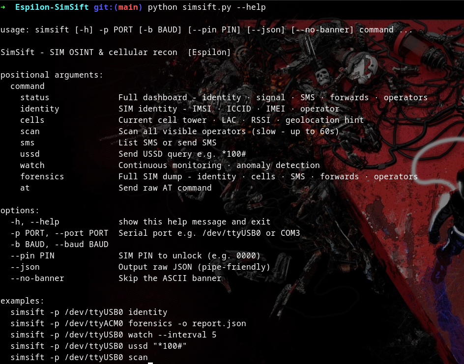
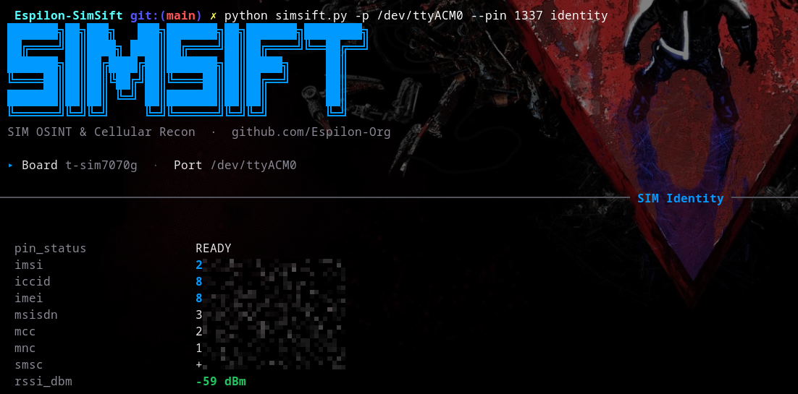

# SimSift




> SIM OSINT & Cellular Recon Tool - passive and active SIM intelligence on a $15 board.
>
> [Espilon Association](https://espilon.net) · Open Source · Security Research

---

SimSift turns a LilyGO cellular board into a field-deployable SIM intelligence tool.
Connect via USB, run a command - get IMSI, ICCID, cell towers, visible operators,
SMS, USSD queries, call-forward detection, and continuous anomaly monitoring.

**No SIM extraction. No SDR. No complex setup.**

---

## Supported Hardware

| Board | Modem | Network | Status |
|-------|-------|---------|--------|
| [LilyGO T-CALL](https://lilygo.cc) | SIM800L | 2G GSM/GPRS | ✅ Supported |
| [LilyGO T-SIM7070G](https://lilygo.cc) | SIM7070G | LTE-M / NB-IoT / 2G | ✅ Supported |

| LilyGO T-CALL - SIM800L | LilyGO T-SIM7070G |
|:---:|:---:|
|  |  |

---

## Install

```bash
git clone https://github.com/EspilonOrg/Espilon-SimSift
cd Espilon-SimSift
pip install -r requirements.txt
```

**Requirements:** Python 3.9+ · `pyserial` · `rich`

---

## Flash Firmware

Flash the SimSift bridge firmware once per board - it never needs updating.

```bash
# LilyGO T-CALL (SIM800L)
./firmware/flash.sh t-call /dev/ttyUSB0

# LilyGO T-SIM7070G
./firmware/flash.sh t-sim7070g /dev/ttyUSB0
```

> Requires [ESP-IDF v5.3](https://docs.espressif.com/projects/esp-idf/en/stable/esp32/get-started/).

---

## Usage

```
python simsift.py -p <port> [--pin <code>] <command>
```

### Commands

| Command | Description |
|---------|-------------|
| `status` | **Full dashboard** - identity · signal · SMS · call forwards · operators |
| `identity` | SIM identity - IMSI · ICCID · IMEI · operator · SMSC |
| `cells` | Current cell tower · LAC · RSSI · RAT + OpenCelliD link |
| `scan` | Scan all visible operators *(up to 60s)* |
| `sms` | List SMS stored on SIM |
| `sms send <num> <msg>` | Send SMS |
| `ussd <code>` | Send USSD query e.g. `*100#` |
| `watch` | Continuous network anomaly monitoring - cell changes · 2G downgrade · call forward detection |
| `forensics` | Full SIM dump to JSON |
| `at <cmd>` | Raw AT passthrough |

### Examples

```bash
# Full dashboard - everything at once
python simsift.py -p /dev/ttyACM0 status

# With PIN-protected SIM
python simsift.py -p /dev/ttyACM0 --pin 1234 status

# Save full forensic dump
python simsift.py -p /dev/ttyACM0 forensics -o report.json

# Monitor network anomalies (5s interval)
python simsift.py -p /dev/ttyACM0 watch --interval 5

# USSD query
python simsift.py -p /dev/ttyACM0 ussd "*100#"

# JSON output for scripting
python simsift.py -p /dev/ttyACM0 --json identity | jq .imsi
```





---

## What it detects

### Without network registration

Everything related to the SIM card itself works offline:

| Info | Command | Notes |
|------|---------|-------|
| IMSI | `AT+CIMI` | Requires PIN unlocked |
| ICCID | `AT+CCID` | Always available |
| IMEI | `AT+CGSN` | Always available |
| MSISDN | `AT+CNUM` | If stored on SIM |
| SMSC | `AT+CSCA` | SMS Service Center address |
| PIN status | `AT+CPIN?` | READY / SIM PIN / SIM PUK |
| Call forwards | `AT+CCFC` | Compromise detection |
| Operator scan | `AT+COPS=?` | Visible networks |

### With network registration

| Info | Source | Notes |
|------|--------|-------|
| LAC + Cell ID | `AT+CREG=2` | Cell tower identifier |
| RAT | `AT+CREG` | GSM / LTE-M / NB-IoT |
| RSRP/RSRQ/SINR | `AT+CPSI` | SIM7070G only |
| Network time | `AT+CCLK?` | When registered |
| USSD response | `AT+CUSD` | Operator account info |
| SMS send | `AT+CMGS` | Requires registration |

### `watch` - Network anomaly monitoring

> Events reported by `watch` have legitimate explanations in normal network
> operation. They are indicators worth investigating, not proof of any attack.

| Event | Trigger | Possible causes |
|-------|---------|-----------------|
| `CELL_CHANGE` | Cell tower changed | Normal handover, movement, or suspicious |
| `2G_DOWNGRADE` | LTE-M → GSM switch | Poor LTE coverage, or forced downgrade |
| `NEW_STRONG_CELL` | Unknown cell stronger than baseline | New tower, or suspicious source |
| `FWD_ACTIVE` | Call forwarding active on SIM | Operator voicemail, or misconfiguration |

### PIN management

```bash
# Activate PIN lock
python simsift.py -p /dev/ttyACM0 at 'AT+CLCK="SC",1,"0000"'

# Change PIN
python simsift.py -p /dev/ttyACM0 at 'AT+CPWD="SC","0000","1234"'

# Unlock at each session
python simsift.py -p /dev/ttyACM0 --pin 1234 status
```

---

## Architecture

```
Laptop / PC
  └── Python CLI (simsift.py)
        └── USB Serial
              └── ESP32 Bridge Firmware  (flash once, never update)
                    └── UART1
                          └── SIM800L / SIM7070G modem
```

The firmware is a **transparent AT proxy** - all intelligence is in Python.
The ESP32 relays USB ↔ modem UART with 4 special commands:

| Command | Effect |
|---------|--------|
| `+++POWERKEY` | Pulse PWRKEY GPIO - power on/off modem |
| `+++RESET` | Hard reset modem |
| `+++BOARD` | Return board name (`t-call` / `t-sim7070g`) |
| `+++BAUD:<n>` | Change modem UART baud rate |

---

## vs. existing tools

| | SimSift | pySIM | SnoopSnitch | SDR tools |
|--|---------|-------|-------------|-----------|
| Hardware cost | ~€15 | ~€20 reader | Android phone | €25–200 |
| SIM extraction required | ❌ | ✅ | ❌ | ❌ |
| Active queries (USSD, SMS) | ✅ | ✅ | ❌ | ❌ |
| Cell tower info | ✅ | ❌ | ✅ | ✅ |
| Anomaly detection | ✅ | ❌ | ✅ | ❌ |
| Field deployable | ✅ | ❌ | ❌ | ❌ |
| Setup complexity | Low | Medium | High | High |

---

## Project structure

```
Espilon-SimSift/
├── firmware/               ESP-IDF bridge (flash once)
│   ├── main/bridge.c
│   ├── configs/
│   │   ├── t-call          LilyGO T-CALL pins
│   │   └── t-sim7070g      LilyGO T-SIM7070G pins
│   └── flash.sh
├── simsift/
│   ├── bridge.py           Serial communication layer
│   ├── modem.py            AT command library (SIM800 + SIM7070G)
│   ├── cli.py              CLI entry point
│   ├── ui.py               Rich visual layer (Espilon palette)
│   └── modules/
│       ├── identity.py     SIM identity
│       ├── cells.py        Cell tower + geolocation
│       ├── watch.py        Anomaly detection
│       ├── forensics.py    Full dump
│       └── status.py       Dashboard
├── simsift.py
└── requirements.txt
```

---

## License

MIT - see [LICENSE](LICENSE).

Part of the [Espilon](https://espilon.net) open-source security research ecosystem.

> **For authorized security research and educational use only.**
